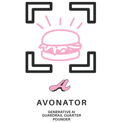

# Avonator Guardrails Service

A production-ready, AI-powered content validation service built with FastAPI, featuring NLP models for toxicity detection, PII identification, and content moderation.

## Features

- **🍔 AI-Powered Validation**: Uses spaCy, Stanza, and HuggingFace models
- **🍔 High Performance**: Async processing with Redis caching
- **🍔 Enterprise Security**: API key authentication, rate limiting, input sanitization
- **🍔 Monitoring**: Prometheus metrics, structured logging, health checks
- **🍔 Docker Ready**: Multi-stage builds, Docker Compose, Kubernetes deployment
- **🍔 CI/CD**: Automated testing, security scanning, deployment pipeline
- **🍔 Scalable**: Horizontal scaling, load balancing, auto-scaling

## Quick Start

### **Option 1: Docker (Recommended)**
```bash
# Clone the repository
git clone https://github.com/Avolyn/avonator.git
cd avonator

# Start with Docker Compose
docker-compose up -d

# Check health
curl http://localhost:8000/v1/guardrails/health
```

### **Option 2: Local Development**
```bash
# Install dependencies
pip install -r enhanced_requirements.txt

# Download NLP models
python -m spacy download en_core_web_sm

# Start the service
uvicorn enhanced_guardrails:app --host 0.0.0.0 --port 8000
```

## API Endpoints

### **Health Check**
```bash
GET /v1/guardrails/health
```

### **Single Text Validation**
```bash
POST /v1/guardrails/validate
Content-Type: application/json
Authorization: Bearer your-api-key

{
  "text": "Your text to validate",
  "guardrail_name": "default"
}
```

### **Batch Validation**
```bash
POST /v1/guardrails/validate/batch
Content-Type: application/json
Authorization: Bearer your-api-key

{
  "texts": ["Text 1", "Text 2", "Text 3"],
  "guardrail_name": "default"
}
```

### **Configuration**
```bash
GET /v1/guardrails/configs
Authorization: Bearer your-api-key
```

## Architecture

```
┌─────────────────┐    ┌─────────────────┐    ┌─────────────────┐
│   FastAPI App   │    │   Redis Cache   │    │  NLP Models     │
│                 │◄──►│                 │    │                 │
│ • Validation    │    │ • Results Cache │    │ • spaCy         │
│ • Rate Limiting │    │ • Session Store │    │ • Stanza        │
│ • Auth          │    │ • Metrics       │    │ • HuggingFace   │
└─────────────────┘    └─────────────────┘    └─────────────────┘
         │
         ▼
┌─────────────────┐    ┌─────────────────┐
│   Monitoring    │    │   Load Balancer │
│                 │    │                 │
│ • Prometheus    │    │ • Nginx         │
│ • Grafana       │    │ • SSL/TLS       │
│ • Logs          │    │ • Rate Limiting │
└─────────────────┘    └─────────────────┘
```

##  Docker Deployment

### **Development**
```bash
docker-compose up -d
```

### **Production**
```bash
docker-compose -f docker-compose.prod.yml up -d
```

### **Kubernetes**
```bash
kubectl apply -f kubernetes_deployment.yaml
```

##  Configuration

### **Environment Variables**
```bash
# Required
GUARDRAILS_API_KEY=your-secure-api-key
REDIS_URL=redis://localhost:6379/0

# Optional
DEBUG=False
LOG_LEVEL=INFO
SPACY_MODEL=en_core_web_sm
HUGGINGFACE_MODEL=unitary/toxic-bert
CACHE_DEFAULT_TTL=300
RATE_LIMIT_REQUESTS=100
RATE_LIMIT_WINDOW=60
```

### **Guardrail Configurations**
- **`default`**: Balanced validation
- **`strict`**: Maximum security
- **`permissive`**: Minimal filtering
- **`content_moderation`**: Focus on content quality

##  Testing

### **Run All Tests**
```bash
pytest tests/ -v
```

### **Run Specific Tests**
```bash
# Unit tests
pytest tests/test_api_endpoints.py -v

# Integration tests
pytest tests/test_integration.py -v

# Performance tests
pytest tests/test_performance.py -v

# Load tests
locust -f tests/load_test.py --host=http://localhost:8000
```

### **With Coverage**
```bash
pytest tests/ -v --cov=enhanced_guardrails --cov-report=html
```

## Monitoring

### **Health Checks**
- **Application**: `http://localhost:8000/v1/guardrails/health`
- **Metrics**: `http://localhost:8000/metrics`
- **API Docs**: `http://localhost:8000/docs`

### **Grafana Dashboards**
- **Service Overview**: `http://localhost:3000`
- **Performance Metrics**: Request duration, throughput, error rates
- **Business Metrics**: Validation results, toxicity detection, PII findings

### **Prometheus Metrics**
- `guardrails_requests_total` - Total API requests
- `guardrails_validation_duration_seconds` - Validation timing
- `guardrails_cache_hits_total` - Cache performance
- `guardrails_model_inference_duration_seconds` - Model performance

## CI/CD Pipeline

The repository includes a complete CI/CD pipeline with:

- **🍔 Automated Testing**: Unit, integration, performance tests
- **🍔 Security Scanning**: Trivy, Bandit, Safety checks
- **🍔 Docker Builds**: Multi-stage builds with security scanning
- **🍔 Code Quality**: Black, isort, Flake8, MyPy
- **🍔 Deployment**: Automated staging and production deployment

### **GitHub Actions**
- Runs on every push and pull request
- Tests Python 3.9 compatibility
- Builds and tests Docker images
- Verifies GitHub secrets configuration

## Project Structure

```
avonator/
├── enhanced_guardrails.py          # Main FastAPI application
├── enhanced_requirements.txt       # Python dependencies
├── config.py                       # Configuration management
├── conftest.py                     # Pytest configuration
├── Dockerfile                      # Multi-stage Docker build
├── docker-compose.yml              # Development environment
├── docker-compose.prod.yml         # Production environment
├── kubernetes_deployment.yaml      # Kubernetes manifests
├── tests/                          # Test suite
│   ├── test_api_endpoints.py      # API endpoint tests
│   ├── test_validators.py         # Validation logic tests
│   ├── test_integration.py        # Integration tests
│   ├── test_performance.py        # Performance tests
│   └── load_test.py               # Load testing with Locust
├── monitoring/                     # Monitoring configuration
│   ├── prometheus.yml             # Prometheus config
│   └── grafana/                   # Grafana dashboards
├── nginx/                         # Reverse proxy config
│   └── nginx.conf
└── .github/workflows/             # CI/CD pipelines
    ├── working-ci.yml             # Main CI pipeline
    ├── test-basic.yml             # Basic functionality tests
    └── ultra-simple.yml           # Ultra-simple tests
```

## Development

### **Setup Development Environment**
```bash
# Clone repository
git clone https://github.com/Avolyn/avonator.git
cd avonator

# Install dependencies
pip install -r enhanced_requirements.txt

# Download NLP models
python -m spacy download en_core_web_sm

# Start Redis (required for caching)
docker run -d --name redis -p 6379:6379 redis:7-alpine

# Run the application
uvicorn enhanced_guardrails:app --reload
```

### **Code Quality**
```bash
# Format code
black .
isort .

# Lint code
flake8 .
mypy enhanced_guardrails.py

# Security scan
bandit -r .
safety check
```

## Documentation

- **[Docker & CI/CD Guide](DOCKER_CI_CD_GUIDE.md)** - Complete deployment guide
- **[GitHub Setup Guide](GITHUB_SETUP_GUIDE.md)** - Repository configuration
- **[Troubleshooting](TROUBLESHOOTING.md)** - Common issues and solutions
- **[Improvements Summary](IMPROVEMENTS_SUMMARY.md)** - Feature overview

## Contributing

1. Fork the repository
2. Create a feature branch (`git checkout -b feature/amazing-feature`)
3. Commit your changes (`git commit -m 'Add amazing feature'`)
4. Push to the branch (`git push origin feature/amazing-feature`)
5. Open a Pull Request

## License

This project is licensed under the MIT License - see the [LICENSE](LICENSE) file for details.

## Support

- **Issues**: [GitHub Issues](https://github.com/Avolyn/avonator/issues)
- **Documentation**: Check the guides in the repository
- **CI/CD**: Check GitHub Actions for build status

---

**Built with 🍔 using FastAPI, Docker, and modern DevOps practices.**
