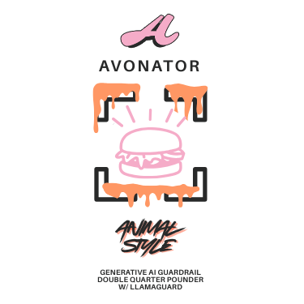

# Avonator Animal Style featuring LlamaGuard-7b

A lightweight, standalone content safety validation service using LlamaGuard-7b. Perfect for integrating into existing GenAI agent solutions.

## Quick Start

### Option 1: Docker (Recommended)

```bash
# Clone and run
git clone <your-repo>
cd llamaguard-animalstyle
docker-compose up -d

# Test the service
curl http://localhost:8000/health
```

### Option 2: Local Development

```bash
# Install dependencies
pip install -r requirements.txt

# Run the service
python api.py
```

## API Endpoints

### Health Check
```bash
GET /health
```

### Single Text Validation
```bash
POST /validate
Content-Type: application/json

{
  "text": "Your text to validate",
  "context": "Optional context"
}
```

### Batch Validation
```bash
POST /validate/batch
Content-Type: application/json

{
  "texts": ["Text 1", "Text 2"],
  "contexts": ["Context 1", "Context 2"]
}
```

## Integration Examples

### Python Integration

```python
import httpx

async def validate_content(text: str) -> bool:
    async with httpx.AsyncClient() as client:
        response = await client.post(
            "http://localhost:8000/validate",
            json={"text": text}
        )
        result = response.json()
        return result["is_safe"]

# Usage
is_safe = await validate_content("Hello, how are you?")
```

### JavaScript/Node.js Integration

```javascript
const axios = require('axios');

async function validateContent(text) {
    try {
        const response = await axios.post('http://localhost:8000/validate', {
            text: text
        });
        return response.data.is_safe;
    } catch (error) {
        console.error('Validation error:', error);
        return false;
    }
}

// Usage
const isSafe = await validateContent("Hello, how are you?");
```

### cURL Examples

```bash
# Validate single text
curl -X POST "http://localhost:8000/validate" \
  -H "Content-Type: application/json" \
  -d '{"text": "Hello, how are you?"}'

# Validate batch
curl -X POST "http://localhost:8000/validate/batch" \
  -H "Content-Type: application/json" \
  -d '{"texts": ["Text 1", "Text 2"]}'
```

## Integration Patterns

### 1. Pre-Processing Validation
Validate user input before sending to your GenAI model:

```python
async def process_user_input(user_input: str):
    # Validate input first
    client = LlamaGuardClient()
    validation = await client.validate_text(user_input, "user_input")
    
    if not validation["is_safe"]:
        return {"error": "Content violates safety guidelines"}
    
    # Process with your GenAI model
    response = await your_genai_model.generate(user_input)
    return response
```

### 2. Post-Processing Validation
Validate AI output before sending to user:

```python
async def generate_response(prompt: str):
    # Generate response
    response = await your_genai_model.generate(prompt)
    
    # Validate output
    client = LlamaGuardClient()
    validation = await client.validate_text(response, "ai_output")
    
    if not validation["is_safe"]:
        return {"error": "Generated content violates safety guidelines"}
    
    return response
```

### 3. Conversation-Level Validation
Validate entire conversation turns:

```python
async def handle_conversation_turn(user_input: str):
    # Validate user input
    input_validation = await client.validate_text(user_input, "user_input")
    
    if not input_validation["is_safe"]:
        return {"error": "Input violates safety guidelines"}
    
    # Generate response
    ai_output = await your_genai_model.generate(user_input)
    
    # Validate AI output
    output_validation = await client.validate_text(ai_output, "ai_output")
    
    if not output_validation["is_safe"]:
        # Regenerate or return safe response
        return {"message": "I cannot provide that response due to safety guidelines"}
    
    return {"message": ai_output}
```

## Configuration

### Environment Variables

```bash
# Model configuration
LLAMAGUARD_MODEL_NAME=meta-llama/LlamaGuard-7b
LLAMAGUARD_DEVICE=auto  # auto, cuda, cpu
LLAMAGUARD_MAX_LENGTH=2048
LLAMAGUARD_TEMPERATURE=0.0
LLAMAGUARD_TOP_P=1.0

# PyTorch configuration
PYTORCH_CUDA_ALLOC_CONF=max_split_size_mb:512
TOKENIZERS_PARALLELISM=false
```

### Docker Configuration

```yaml
# docker-compose.yml
services:
  llamaguard:
    build: .
    ports:
      - "8000:8000"
    environment:
      - PYTORCH_CUDA_ALLOC_CONF=max_split_size_mb:512
    volumes:
      - model_cache:/app/models
    deploy:
      resources:
        reservations:
          devices:
            - driver: nvidia
              count: 1
              capabilities: [gpu]
```

## Customization

### Custom Model Loading

```python
from animalstyleservice import AnimalStyleService

# Custom configuration
service = AnimalStyleService(
    model_name="meta-llama/LlamaGuard-7b",
    device="cuda"
)

# Load model
await service.load_model()

# Validate content
result = await service.validate(ValidationRequest(text="Your text"))
```

### Custom Validation Logic

```python
async def custom_validate(text: str) -> bool:
    # Your custom validation logic
    if len(text) < 10:
        return False
    
    # Use LlamaGuard-7b
    client = LlamaGuardClient()
    result = await client.validate_text(text)
    
    return result["is_safe"]
```

## Response Format

### Single Validation Response

```json
{
  "is_safe": true,
  "safety_level": "safe",
  "confidence": 0.95,
  "violations": [],
  "model_info": {
    "model": "meta-llama/LlamaGuard-7b",
    "device": "cuda",
    "input_length": 25
  }
}
```

### Batch Validation Response

```json
[
  {
    "is_safe": true,
    "safety_level": "safe",
    "confidence": 0.95,
    "violations": [],
    "model_info": {...}
  },
  {
    "is_safe": false,
    "safety_level": "unsafe",
    "confidence": 0.9,
    "violations": ["Detected violence content"],
    "model_info": {...}
  }
]
```

## Error Handling

### Common Error Scenarios

1. **Model Loading Errors**
   - Check internet connectivity
   - Verify sufficient disk space
   - Ensure proper permissions

2. **CUDA/GPU Issues**
   - Verify NVIDIA drivers
   - Check Docker GPU support
   - Fall back to CPU

3. **Memory Issues**
   - Reduce max_length parameter
   - Enable model caching
   - Use quantization

### Error Response Format

```json
{
  "is_safe": false,
  "safety_level": "unsafe",
  "confidence": 0.0,
  "violations": ["Validation error: Model loading failed"],
  "model_info": {
    "error": true
  }
}
```

## Monitoring

### Health Check

```bash
curl http://localhost:8000/health
```

Response:
```json
{
  "status": "healthy",
  "model_loaded": true,
  "device": "cuda"
}
```

### Logs

```bash
# View service logs
docker-compose logs -f llamaguard

# Check specific logs
docker-compose logs llamaguard | grep ERROR
```

## Production Deployment

### Kubernetes Deployment

```yaml
apiVersion: apps/v1
kind: Deployment
metadata:
  name: llamaguard
spec:
  replicas: 2
  selector:
    matchLabels:
      app: llamaguard
  template:
    metadata:
      labels:
        app: llamaguard
    spec:
      containers:
      - name: llamaguard
        image: llamaguard:latest
        ports:
        - containerPort: 8000
        resources:
          requests:
            nvidia.com/gpu: 1
          limits:
            nvidia.com/gpu: 1
```

### Load Balancer Configuration

```yaml
apiVersion: v1
kind: Service
metadata:
  name: llamaguard-service
spec:
  selector:
    app: llamaguard
  ports:
  - port: 80
    targetPort: 8000
  type: LoadBalancer
```

## Performance Tips

1. **Use GPU**: Enable CUDA for faster inference
2. **Model Caching**: Cache models to avoid reloading
3. **Batch Processing**: Use batch endpoints for multiple texts
4. **Connection Pooling**: Reuse HTTP connections
5. **Async Processing**: Use async/await for better performance

## Security Considerations

1. **Network Security**: Use HTTPS in production
2. **Authentication**: Add API keys if needed
3. **Rate Limiting**: Implement rate limiting
4. **Input Validation**: Validate input before processing
5. **Error Handling**: Don't expose sensitive error details

## License

This project is licensed under the MIT License.

## Contributing

1. Fork the repository
2. Create a feature branch
3. Make your changes
4. Add tests
5. Submit a pull request

## Support

- **Issues**: GitHub Issues
- **Documentation**: This README
- **Examples**: See `client_example.py`


